# DIMAR Ferretería — Sistema E-commerce y Gestión

Sistema integral para **DIMAR Ferretería** (Ilo, Moquegua – Perú): tienda online, punto de venta (POS), inventario, contabilidad, CRM y administración de personal. Implementa modelos de calidad de software basados en **TSP**, **CMMI-DEV Nivel 2** y **Scrum**.

- 🌐 **Producción:** https://ferreteria-dimar.vercel.app
- 📍 **Ubicación:** Ilo, Moquegua – Perú
- 📞 **Contacto:** (+51) 931 697 638

---

## 📑 Índice

1. [Introducción](#1-introducción)
2. [Objetivos](#2-objetivos)
3. [Marco Organizacional (TSP)](#3-marco-organizacional-tsp)
4. [Gestión de Requerimientos](#4-gestión-de-requerimientos-reqm)
5. [Planificación del Proyecto (PP)](#5-planificación-del-proyecto-pp)
6. [Gestión de la Configuración (CM)](#6-gestión-de-la-configuración-cm)
7. [Aseguramiento de la Calidad (PPQA)](#7-aseguramiento-de-la-calidad-ppqa)
8. [Medición y Análisis (MA)](#8-medición-y-análisis-ma)
9. [Verificación y Validación](#9-verificación-y-validación)
10. [Diagramas UML](#10-diagramas-uml)
11. [Evaluación de Cumplimiento CMMI](#11-evaluación-de-cumplimiento-cmmi)
12. [Stack Tecnológico](#12-stack-tecnológico)
13. [Instalación y Despliegue](#13-instalación-y-despliegue)
14. [Conclusiones y Recomendaciones](#14-conclusiones-y-recomendaciones)
15. [Anexos](#15-anexos)

---

## 1. Introducción

DIMAR Ferretería requería digitalizar su operación: catálogo online, ventas presenciales, control de stock en tiempo real, facturación electrónica local y un panel administrativo robusto. Este proyecto entrega una plataforma web responsive con backend serverless, aplicando estándares de **calidad de software (CMMI-DEV Nivel 2)** y un proceso ágil **Scrum** apoyado en prácticas de **TSP** (Team Software Process).

## 2. Objetivos

### 2.1 Objetivo General
Implementar un sistema integral de e-commerce y gestión interna para DIMAR Ferretería, garantizando trazabilidad, calidad de producto y cumplimiento de buenas prácticas de ingeniería de software.

### 2.2 Objetivos Específicos
- Centralizar catálogo, stock, ventas y compras en una única plataforma.
- Automatizar el Kardex y la deducción de stock vía triggers de base de datos.
- Habilitar canales digitales: tienda web, WhatsApp Business y POS físico.
- Asegurar la información mediante Row-Level Security y roles diferenciados.
- Documentar el proceso bajo el marco CMMI-DEV Nivel 2.

---

## 3. Marco Organizacional (TSP)

### 3.1 Matriz RACI

| Rol | Análisis | Diseño | Desarrollo | QA | Despliegue |
|-----|:--------:|:------:|:----------:|:--:|:----------:|
| Product Owner | A | C | I | C | I |
| Scrum Master | R | R | C | C | C |
| Dev Frontend | C | R | R | C | C |
| Dev Backend | C | R | R | C | R |
| QA Tester | I | C | C | R | C |
| DevOps | I | I | C | C | R |

*(R: Responsable · A: Aprobador · C: Consultado · I: Informado)*

### 3.2 Estrategia de Desarrollo
**Scrum + TSP** con sprints de 2 semanas, ceremonias estándar (planning, daily, review, retrospective) y artefactos TSP (LAUNCH, STRATEGY, PLAN, QUALITY).

### 3.3 Herramientas de Gestión
- **Jira / GitHub Projects** — backlog, sprints, tableros Kanban.
- **GitHub** — control de versiones y revisiones de código (Pull Requests).
- **Vercel** — CI/CD y despliegue continuo.
- **Supabase Dashboard** — administración de base de datos y autenticación.

### 3.4 Cronograma (5 sprints)

| Sprint | Foco | Entregable |
|:------:|------|------------|
| 1 | Setup, auth y catálogo | Login, registro, productos |
| 2 | Carrito y checkout | Flujo de compra online |
| 3 | POS y Kardex | Punto de venta + stock automático |
| 4 | Contabilidad y CRM | Transacciones, clientes VIP |
| 5 | Reportes y QA final | Excel, backups, hardening |

---

## 4. Gestión de Requerimientos (REQM)

### 4.1 Requerimientos Funcionales

| ID | Descripción | Prioridad |
|----|-------------|:---------:|
| RF-01 | Registro/Login con email y verificación | Alta |
| RF-02 | Catálogo público con filtros y búsqueda | Alta |
| RF-03 | Carrito de compras y checkout | Alta |
| RF-04 | Punto de venta (POS) con cálculo de cambio | Alta |
| RF-05 | Gestión de productos, categorías, marcas | Alta |
| RF-06 | Kardex automatizado (entradas/salidas) | Alta |
| RF-07 | Gestión de proveedores y órdenes de compra | Media |
| RF-08 | CRM con clasificación VIP | Media |
| RF-09 | Gestión de personal y asistencia | Media |
| RF-10 | Notificaciones realtime al staff | Media |
| RF-11 | Reportes contables y exportación Excel | Alta |
| RF-12 | Backup en JSON descargable | Alta |

### 4.2 Requerimientos No Funcionales
- **Seguridad:** RLS en todas las tablas, roles separados en `user_roles`.
- **Rendimiento:** Tiempo de carga < 3 s (LCP), TanStack Query con caché.
- **Escalabilidad:** Backend serverless (Edge Functions).
- **Usabilidad:** Diseño responsive, soporte modo oscuro/claro.
- **Disponibilidad:** 99.5% (Vercel + Supabase SLA).

---

## 5. Planificación del Proyecto (PP)

**WBS (Work Breakdown Structure):**

```
1. DIMAR Sistema
├── 1.1 Frontend (React + Vite)
│   ├── 1.1.1 Tienda pública
│   ├── 1.1.2 Panel Admin
│   └── 1.1.3 POS
├── 1.2 Backend (Supabase)
│   ├── 1.2.1 Esquema y migraciones
│   ├── 1.2.2 RLS y roles
│   └── 1.2.3 Edge Functions
├── 1.3 QA y Testing
└── 1.4 Despliegue (Vercel + GitHub Actions)
```

**Gestión de Riesgos:**

| Riesgo | Probabilidad | Impacto | Mitigación |
|--------|:------------:|:-------:|------------|
| Pérdida de datos | Baja | Alto | Backups JSON + replicación Supabase |
| Cambio de alcance | Media | Medio | Sprint review formal |
| Vulnerabilidad RLS | Baja | Alto | Linter + revisiones de políticas |
| Caída del proveedor | Baja | Alto | Multi-región Vercel |

---

## 6. Gestión de la Configuración (CM)

- **VCS:** Git con flujo **GitFlow** (`main`, `develop`, `feature/*`, `hotfix/*`).
- **Convención de commits:** Conventional Commits (`feat:`, `fix:`, `chore:`).
- **CI/CD:** Vercel ejecuta build automático en cada push a `main`.
- **Migraciones:** Versionadas en `supabase/migrations/` con timestamp.
- **Configuración:** Variables de entorno en Vercel (no commiteadas).

---

## 7. Aseguramiento de la Calidad (PPQA)

### 7.1 Política de calidad

- **TypeScript 5.8** en modo estricto (`strict: true`, `noImplicitAny`, `strictNullChecks`).
- **ESLint 9** con `typescript-eslint`, `react-hooks` y `react-refresh`.
- **Conventional Commits** y **Pull Request obligatorio** con mínimo 1 reviewer.
- **Checklist QA** por feature: UI responsive (≥360 px), validaciones Zod, RLS verificada, accesibilidad AA.
- **Auditoría de seguridad** con Supabase Linter y revisión manual de políticas RLS.

### 7.2 Estrategia de Testing (pirámide)

```
              ▲
             ╱ ╲    E2E (Playwright / manual QA)
            ╱───╲   ── flujos críticos: checkout, POS, login
           ╱     ╲
          ╱ Integ ╲   Integration (Vitest + Testing Library)
         ╱─────────╲  ── render de páginas con providers, hooks con React Query
        ╱           ╲
       ╱   Unitarios ╲ Unit (Vitest)
      ╱───────────────╲── utils, validadores Zod, reducers, helpers de cálculo
     ╱─────────────────╲
    ╱  Estáticos (TS, ESLint, type-check, supabase linter)
   ╱───────────────────╲
```

| Capa | Herramienta | Cobertura objetivo | Ejecución |
|------|-------------|:------------------:|-----------|
| Estático | `tsc --noEmit`, `eslint .` | 100% archivos | Pre-commit + CI |
| Unit (frontend) | Vitest + `@testing-library/react` + jsdom | ≥ 60 % | `npm test` |
| Integración (frontend) | Vitest + MSW (mock Supabase) | flujos principales | `npm test` |
| Edge Functions (backend) | `deno test` con `--allow-net --allow-env` | handlers críticos | CI Supabase |
| Base de datos | `supabase db lint` + queries de verificación | RLS de cada tabla | Post-migración |
| E2E | Playwright (recomendado) o QA manual guiado | checkout, POS, auth | Pre-release |
| Performance | Lighthouse CI / Vercel Speed Insights | LCP < 2.5 s | Post-deploy |
| Seguridad | Supabase Security Advisor + revisión RLS | 0 críticos | Cada migración |

### 7.3 Cómo correr los tests

```bash
# Frontend — todos los tests una sola vez (CI):
npm test

# Frontend — modo watch (durante desarrollo):
npm run test:watch

# Type-check sin emitir build:
npx tsc --noEmit

# Lint:
npm run lint

# Backend (Edge Functions) — requiere Deno instalado:
deno test supabase/functions/ --allow-net --allow-env

# Linter de base de datos:
npx supabase db lint
```

### 7.4 Convenciones de tests

- Archivos de test colocados junto al código: `src/components/Foo.tsx` + `src/components/Foo.test.tsx`.
- Nombres tipo `describe("ComponentName") > it("hace X cuando Y")`.
- Para hooks con React Query usar `QueryClientProvider` envoltorio en cada test.
- Para Supabase, mockear `@/integrations/supabase/client` con `vi.mock(...)`.
- Cada bug reportado debe acompañarse de un test de regresión antes de cerrar el ticket.

---

## 8. Medición y Análisis (MA)

| Métrica | Objetivo | Herramienta |
|---------|:--------:|-------------|
| Cobertura de tests | ≥ 60% | Vitest |
| Defectos por sprint | ≤ 5 | Jira |
| LCP (Largest Contentful Paint) | < 2.5 s | Vercel Analytics |
| Disponibilidad mensual | ≥ 99.5% | Vercel/Supabase |
| Velocity del equipo | 25 SP/sprint | Jira |

---

## 9. Verificación y Validación

- **Verificación:** Code review, linter, tests unitarios, type-check.
- **Validación:** Demos al PO al cierre de cada sprint, pruebas de aceptación con la dueña de la tienda.
- **Bitácora de defectos:** clasificación por severidad (Crítica, Alta, Media, Baja).

---

## 10. Diagramas UML

> Todos los diagramas están en formato **Mermaid** y se renderizan nativamente en GitHub y la mayoría de editores Markdown. Cubrimos los cuatro grupos clásicos de UML 2.5: **estructurales** (clases, componentes, paquetes, despliegue), **de comportamiento** (casos de uso, actividades, estados) y **de interacción** (secuencia, comunicación). Se añaden además vistas C4 (contexto/contenedores), ERD y un mapa de viajes de usuario.

### 10.1 Casos de Uso

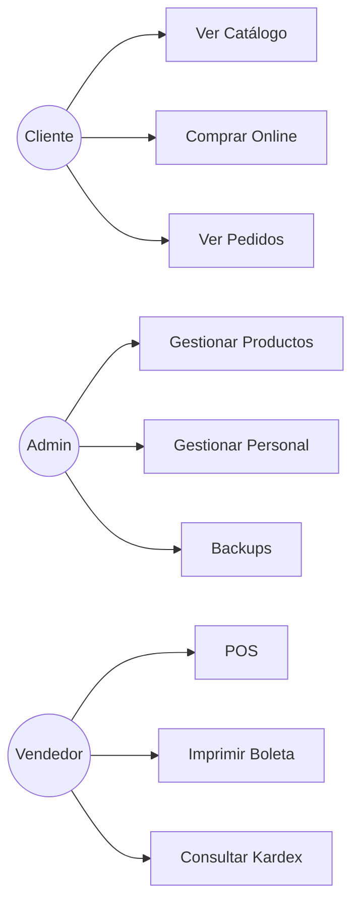

### 10.2 Diagrama de Contexto C4 (Nivel 1)

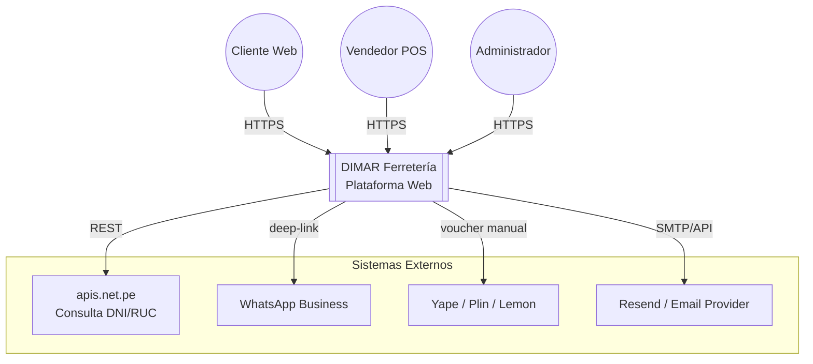

### 10.3 Diagrama de Contenedores C4 (Nivel 2)

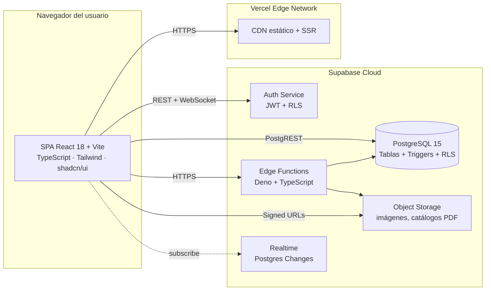

### 10.4 Diagrama de Paquetes (Frontend)

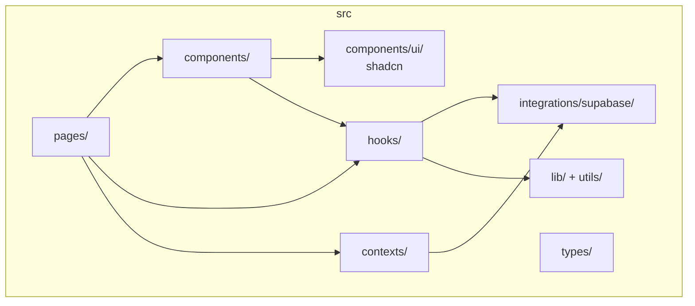

### 10.5 Diagrama de Clases (Dominio)

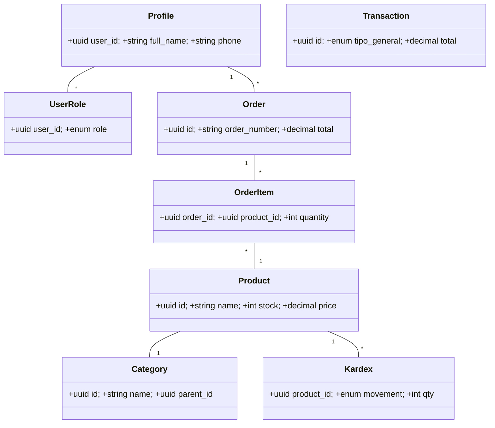

### 10.6 Secuencia — Venta POS

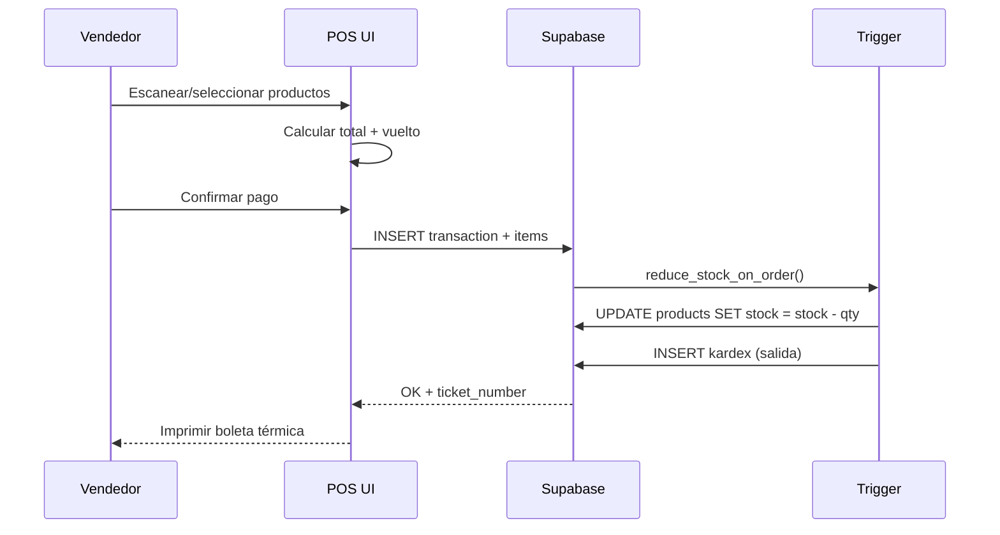

### 10.7 Secuencia — Login y carga de sesión

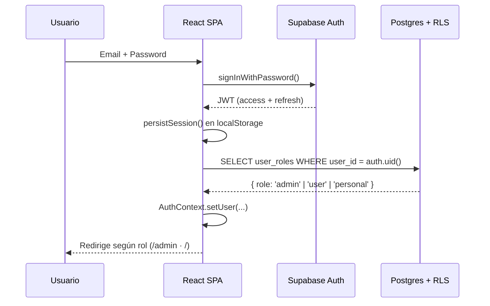

### 10.8 Secuencia — Stock automático vía Trigger

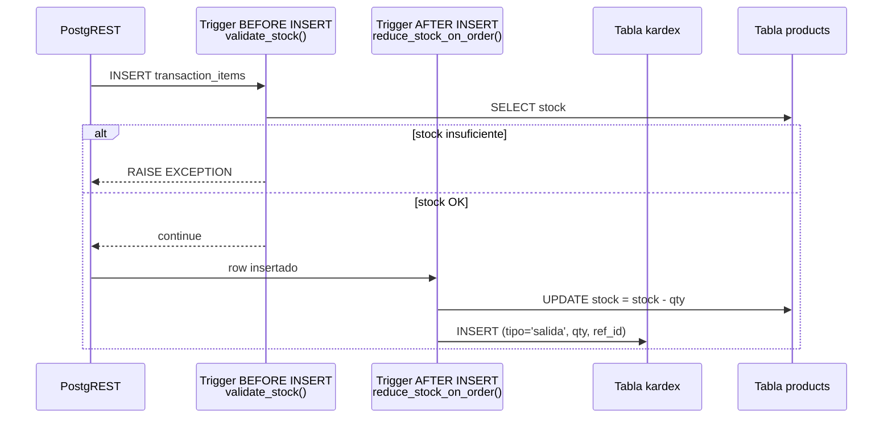

### 10.9 Actividades — Checkout Online

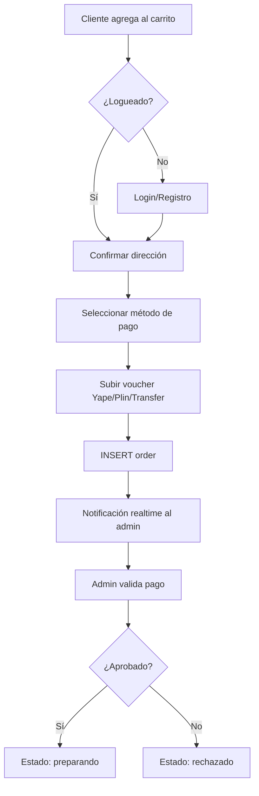

### 10.10 Estados — Ciclo de Vida de un Pedido

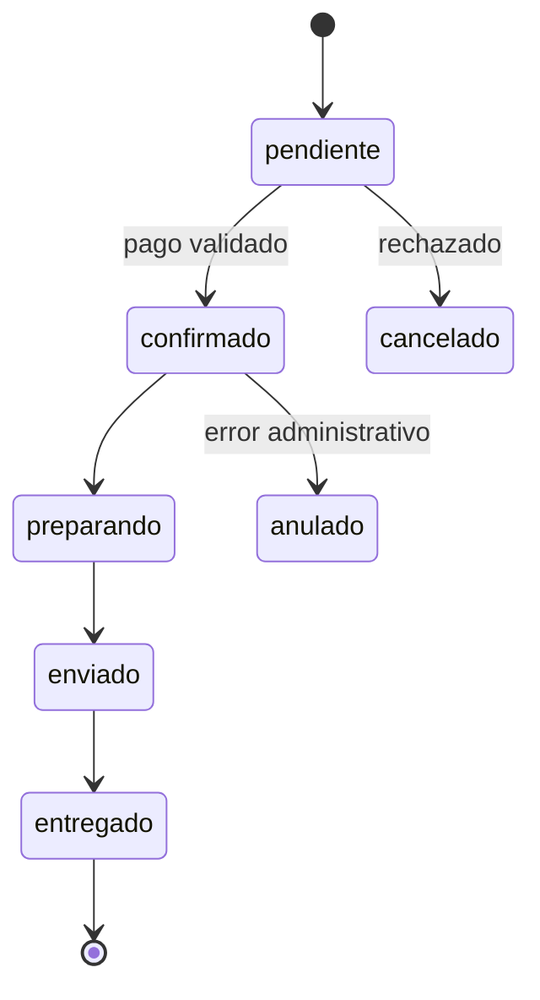

### 10.11 Estados — Asistencia de Personal

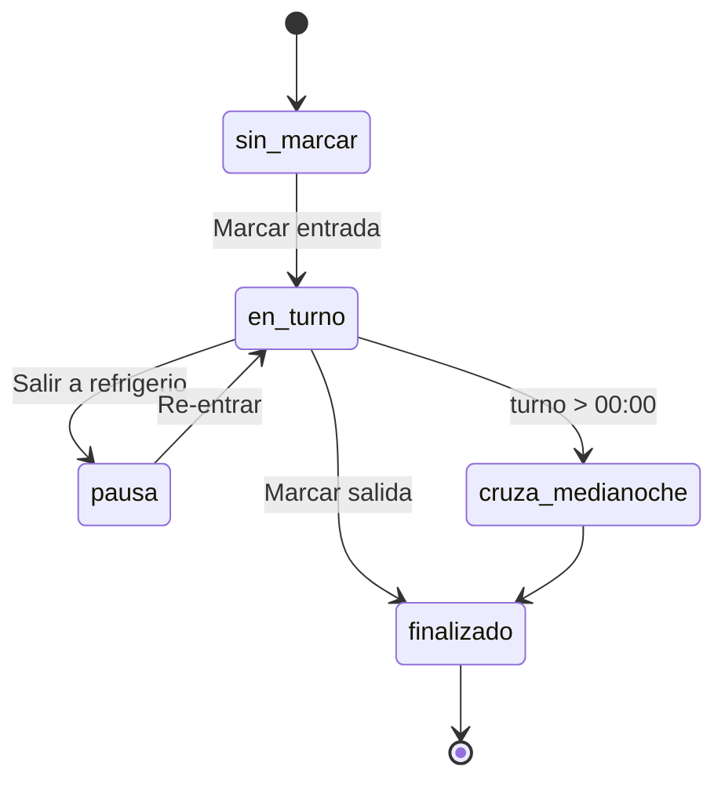

### 10.12 Componentes

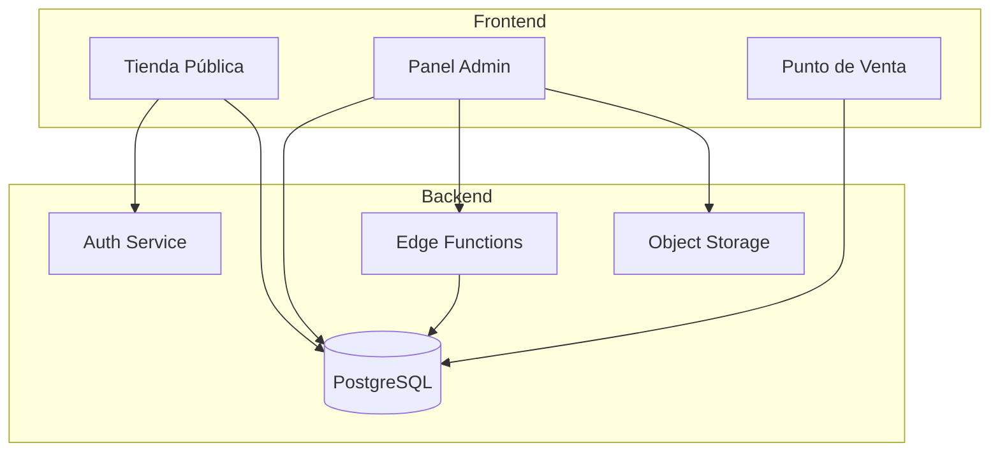

### 10.13 Despliegue (Deployment Diagram)

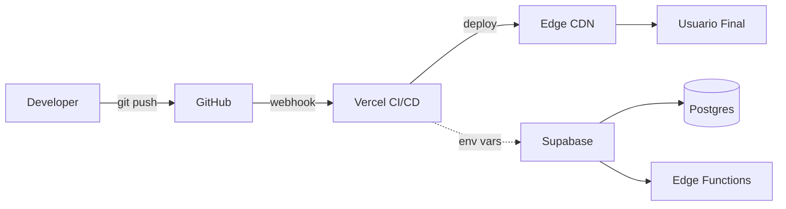

### 10.14 Comunicación — Notificaciones Realtime

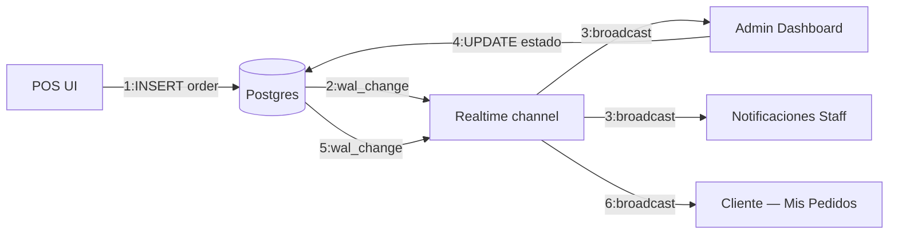

### 10.15 Viaje de Usuario — Compra Online

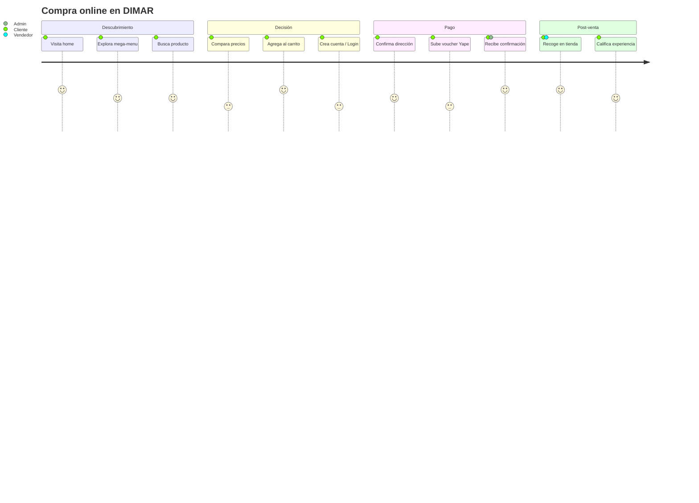

### 10.16 Entidad-Relación (ER)

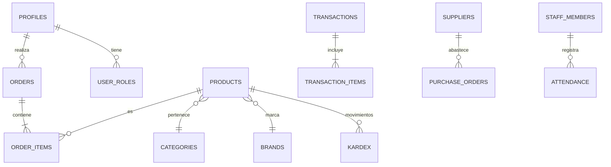

### 10.17 Gantt — Cronograma de Sprints

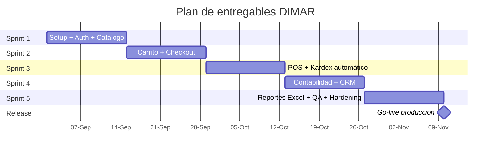

### 10.18 Pipeline de CI/CD

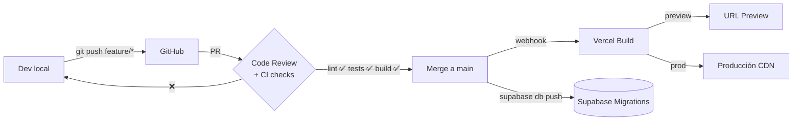

---

## 11. Evaluación de Cumplimiento CMMI

| Área de Proceso | Nivel | Estado |
|-----------------|:-----:|:------:|
| REQM (Gestión de Requerimientos) | 2 | ✅ Cumple |
| PP (Planificación del Proyecto) | 2 | ✅ Cumple |
| PMC (Monitoreo y Control) | 2 | ✅ Cumple |
| CM (Gestión de Configuración) | 2 | ✅ Cumple |
| PPQA (Aseguramiento de Calidad) | 2 | ✅ Cumple |
| MA (Medición y Análisis) | 2 | 🟡 Parcial |
| SAM (Gestión de Acuerdos) | 2 | 🟡 Parcial |

**Brechas detectadas:** mayor automatización de métricas, definir SLAs formales con proveedores externos.

---

## 12. Stack Tecnológico

### 12.1 Versiones actuales (en producción)

| Capa | Tecnología | Versión actual | Estado |
|------|------------|:--------------:|:------:|
| Runtime UI | **React** | **18.3.1** | LTS, soportado |
| DOM bindings | react-dom | 18.3.1 | LTS |
| Build tool | **Vite** | **5.4.19** | Estable |
| Plugin React | @vitejs/plugin-react-swc | 3.11.0 | Estable |
| Lenguaje | **TypeScript** | **5.8.3** | Estable |
| Estilos | **Tailwind CSS** | **3.4.17** | Estable (v4 disponible) |
| Componentes | shadcn/ui + Radix UI | última | Estable |
| Estado servidor | @tanstack/react-query | 5.83.0 | Estable |
| Formularios | react-hook-form + zod | 7.61 / 3.25 | Estable |
| Animación | framer-motion | 12.34 | Estable |
| Router | react-router-dom | 6.30.1 | Estable (v7 disponible) |
| Cliente BD | @supabase/supabase-js | 2.97.0 | Estable |
| Backend | PostgreSQL (Supabase) | 15.x | LTS |
| Edge runtime | Deno | 1.45+ | Estable |
| Hosting | Vercel Edge Network | — | — |
| Testing | Vitest | 3.2.4 | Estable |
| Testing UI | @testing-library/react | 16.0 | Estable |
| Lint | ESLint | 9.32 | Estable |
| Node (build) | Node.js | ≥ 18.18 (recomendado 20 LTS) | LTS |

### 12.2 Política de versiones y soporte

- **Semver** estricto: `^` para minors, fijo para mayores.
- Auditoría mensual con `npm outdated` y `npm audit`.
- Sólo se sube de **mayor** después de leer el changelog y correr la batería completa de tests.
- Dependencias críticas (React, Supabase, Vite) se actualizan en una rama dedicada `chore/upgrade-*` con su propio PR.

### 12.3 React 18 hoy → React 19 mañana (plan de actualización)

**Estado actual:** el proyecto corre sobre **React 18.3.1**, que es la última 18 estable y es la versión recomendada como puente oficial hacia React 19 (incluye los warnings de deprecación de 19).

**¿Por qué seguimos en 18?**
1. Ecosistema 100% compatible (Radix, shadcn/ui, framer-motion, react-router 6, recharts).
2. Vite + plugin-react-swc soportan 18 sin fricción.
3. Permite enfocar el sprint actual en negocio (POS, kardex) y no en migración.

**Plan formal de migración a React 19** (planeado para sprint post-release):

```
┌──────────────────────────────────────────────────────────────────┐
│  Fase 1 — Preparación (1 día)                                    │
│   • npm i react@19 react-dom@19 @types/react@19 @types/react-dom │
│   • Revisar codemod oficial:                                     │
│     npx codemod@latest react/19/migration-recipe                 │
│   • Quitar defaultProps de componentes funcionales               │
│   • Reemplazar string refs (ninguno detectado actualmente)       │
│                                                                  │
│  Fase 2 — Adaptación de librerías (1-2 días)                     │
│   • Subir react-router-dom 6 → 7 (opcional, compatible con 19)   │
│   • Verificar framer-motion ≥ 12 (ya OK)                         │
│   • Verificar @tanstack/react-query ≥ 5 (ya OK)                  │
│   • Verificar Radix UI compat (release notes)                    │
│                                                                  │
│  Fase 3 — Adopción de features nuevos (opcional)                 │
│   • Reemplazar wrappers de fetch por hook `use()`                │
│   • Migrar formularios a Actions + useActionState                │
│   • Usar <form action={...}> donde aplique                       │
│   • Aprovechar el nuevo Compilador React (auto-memo)             │
│                                                                  │
│  Fase 4 — QA (1 día)                                             │
│   • npm run lint && tsc --noEmit && npm test                     │
│   • Smoke test manual: login, checkout, POS, admin               │
│   • Deploy a preview en Vercel y validación con stakeholder      │
│                                                                  │
│  Fase 5 — Release                                                │
│   • Merge a main, deploy a producción, tag v2.0.0                │
└──────────────────────────────────────────────────────────────────┘
```

**Riesgos detectados:**

| Riesgo | Probabilidad | Mitigación |
|--------|:------------:|------------|
| Incompatibilidad de Radix con React 19 | Baja | Esperar releases de Radix con peerDep "^19" |
| Cambios en `useEffect` strict-effects | Media | Tests + StrictMode ya activo en `main.tsx` |
| Tailwind v3 → v4 (cambio de motor) | Media | Migración separada (ver 12.4) |
| Vite 5 → 6 (Rolldown) | Baja | Vite 5 LTS hasta 2026 |

### 12.4 Roadmap de upgrades complementarios

| Paquete | Hoy | Próximo objetivo | Cuándo |
|---------|:---:|:----------------:|:------:|
| Tailwind | 3.4 | 4.x (Oxide engine) | Q1 después de React 19 |
| react-router | 6.30 | 7.x | Junto con React 19 |
| Vite | 5.4 | 6.x | Cuando llegue a stable |
| Node | 20 LTS | 22 LTS | Cuando Vercel lo recomiende |
| Supabase JS | 2.x | 2.x (auto) | Continuo |

---

## 13. Instalación y Despliegue

### 13.1 Guía paso a paso (desde cero, sin experiencia previa)

Esta guía asume que la computadora **no tiene nada instalado**. Sigue los pasos en orden.

#### Paso 1 — Instalar Git
1. Descarga Git desde **https://git-scm.com/downloads**.
2. Ejecuta el instalador con todas las opciones por defecto.
3. Verifica abriendo una terminal (CMD o PowerShell) y ejecutando:
   ```bash
   git --version
   ```

#### Paso 2 — Instalar Node.js (incluye npm)
1. Descarga la versión **LTS** desde **https://nodejs.org/** (≥ 18).
2. Instálalo con todas las opciones por defecto (deja marcada la opción "Add to PATH").
3. Verifica:
   ```bash
   node --version
   npm --version
   ```

#### Paso 3 — Instalar Visual Studio Code
1. Descarga desde **https://code.visualstudio.com/**.
2. Instálalo con las opciones por defecto.
3. Extensiones recomendadas (instalar desde la pestaña *Extensions*):
   - **ES7+ React/Redux/React-Native snippets**
   - **Tailwind CSS IntelliSense**
   - **ESLint**
   - **Prettier - Code formatter**
   - **GitLens**

#### Paso 4 — Descargar el proyecto
Opción A (con Git, recomendado):
```bash
git clone https://github.com/<tu-org>/dimar-ferreteria.git
cd dimar-ferreteria
```

Opción B (sin Git): descarga el ZIP desde GitHub → *Code → Download ZIP*, descomprímelo y abre la carpeta en VS Code.

#### Paso 5 — Abrir el proyecto en VS Code
1. Abre VS Code → *File → Open Folder…* → selecciona la carpeta `dimar-ferreteria`.
2. Abre la terminal integrada con **Ctrl + Ñ** (o *Terminal → New Terminal*).

#### Paso 6 — Instalar las dependencias del proyecto
En la terminal de VS Code:
```bash
npm install
```
Este comando lee `package.json` y descarga **todas** las librerías (React, Vite, Tailwind, Supabase JS, etc.) en la carpeta `node_modules/`. Puede tardar 2–5 minutos.

> Alternativa más rápida: `bun install` (requiere [Bun](https://bun.sh) instalado).

#### Paso 7 — Configurar variables de entorno
1. En la raíz del proyecto crea un archivo llamado **`.env`** (sin nombre antes del punto).
2. Pega dentro:
   ```env
   VITE_SUPABASE_URL=https://<project-ref>.supabase.co
   VITE_SUPABASE_PUBLISHABLE_KEY=<publishable-key>
   VITE_SUPABASE_PROJECT_ID=<project-id>
   ```
3. Reemplaza los valores con los de **tu proyecto Supabase** (los obtienes en *Project Settings → API*).

> ✅ Estos valores son **publishable / anon**: están pensados para vivir en el frontend y son seguros de compartir. La seguridad real está en las políticas RLS de la base de datos.
>
> ❌ La `service_role key` **jamás** debe ir en el `.env` del frontend ni subirse al repositorio.

#### Paso 8 — Iniciar el servidor de desarrollo
```bash
npm run dev
```
Abre el navegador en **http://localhost:8080** (o el puerto que indique la terminal). Cualquier cambio en el código se refleja al instante (Hot Module Reload).

#### Paso 9 — Crear el primer usuario administrador
1. Entra a `/registro` y crea una cuenta con tu correo.
2. Confirma el correo desde tu bandeja de entrada.
3. En Supabase, abre *Table Editor → user_roles* y cambia tu rol a `admin`.

#### Paso 10 — Compilar para producción (build)
```bash
npm run build
```
Esto genera la carpeta `dist/` lista para subir a cualquier hosting estático.

Para previsualizar el build local:
```bash
npm run preview
```

---

### 13.2 Comandos útiles

| Comando | Descripción |
|---------|-------------|
| `npm run dev` | Inicia el servidor de desarrollo |
| `npm run build` | Compila la versión de producción |
| `npm run preview` | Previsualiza el build localmente |
| `npm run lint` | Ejecuta ESLint |
| `npx vitest run` | Ejecuta los tests unitarios |

### 13.3 Estructura del proyecto

```
dimar-ferreteria/
├── public/              # Assets estáticos (favicon, robots.txt)
├── src/
│   ├── assets/          # Imágenes y logos
│   ├── components/ui/   # Componentes shadcn/ui
│   ├── features/
│   │   ├── admin/       # Panel administrativo
│   │   ├── auth/        # Autenticación
│   │   ├── cart/        # Carrito de compras
│   │   ├── checkout/    # Proceso de pago
│   │   └── shop/        # Tienda pública
│   ├── hooks/           # React hooks personalizados
│   ├── integrations/    # Cliente Supabase (auto-generado)
│   ├── lib/             # Utilidades y constantes
│   └── main.tsx         # Punto de entrada
├── supabase/
│   ├── functions/       # Edge Functions (Deno)
│   └── migrations/      # Migraciones SQL versionadas
├── .env                 # Variables de entorno (NO subir a Git)
├── package.json
└── vite.config.ts
```

### 13.4 Despliegue en Vercel (paso a paso)

1. Sube el proyecto a un repositorio de **GitHub**:
   ```bash
   git init
   git add .
   git commit -m "feat: initial commit"
   git branch -M main
   git remote add origin https://github.com/<tu-usuario>/dimar-ferreteria.git
   git push -u origin main
   ```
2. Crea una cuenta en **https://vercel.com** (puedes usar tu cuenta de GitHub).
3. *Add New Project → Import Git Repository* → selecciona `dimar-ferreteria`.
4. Vercel detecta automáticamente que es un proyecto **Vite**. Deja la configuración por defecto:
   - **Framework Preset:** Vite
   - **Build Command:** `npm run build`
   - **Output Directory:** `dist`
5. En *Environment Variables* agrega:
   - `VITE_SUPABASE_URL`
   - `VITE_SUPABASE_PUBLISHABLE_KEY`
   - `VITE_SUPABASE_PROJECT_ID`
6. Click en **Deploy**. En 1–2 minutos la app estará en línea.
7. Cada `git push` a `main` ejecuta un nuevo deploy automáticamente.
8. URL de producción actual: **https://ferreteria-dimar.vercel.app**

### 13.5 Configurar Supabase desde cero

1. Crea una cuenta en **https://supabase.com** → *New Project*.
2. Anota la **URL** y la **anon/publishable key** desde *Project Settings → API*.
3. En *SQL Editor* ejecuta, en orden, cada archivo de `supabase/migrations/`.
4. En *Authentication → Providers* habilita **Email** y opcionalmente **Google**.
5. En *Storage* crea los buckets: `product-images`, `brand-logos`, `receipt-assets`, `category-catalogs` (todos públicos).
6. Actualiza las variables de entorno en Vercel con los nuevos valores y vuelve a desplegar.

### 13.6 Solución de problemas comunes

| Problema | Solución |
|----------|----------|
| `npm: command not found` | Reinstalar Node.js y reiniciar la terminal |
| Puerto 8080 ocupado | Cambiar el puerto en `vite.config.ts` |
| `Invalid API key` | Revisar que el `.env` esté en la raíz y reiniciar `npm run dev` |
| Pantalla en blanco tras build | Revisar la consola del navegador (F12) por errores |
| No puedo iniciar sesión | Verificar que el correo esté confirmado en Supabase Auth |

---

## 14. Conclusiones y Recomendaciones

El sistema cumple con los objetivos planteados y los lineamientos de **CMMI-DEV Nivel 2**. Se recomienda:
- Automatizar el dashboard de métricas (MA).
- Incorporar pruebas E2E con Playwright.
- Formalizar el SLA con los proveedores de servicios cloud.
- Capacitar al personal en el uso del módulo POS y CRM.

---

## 15. Anexos

- **Evidencias Jira:** tableros y reportes de velocity.
- **Capturas del Sistema:** ver carpeta https://drive.google.com/drive/folders/1xBSykE-jT6KWJYYXtF-XehdBqj7kM0P0?usp=sharing.
- **Diagramas UML:** sección 10 de este documento.
- **Evidencias de Testing:** reportes Vitest en CI.
- **Enlace del Sistema:** https://ferreteria-dimar.vercel.app

---

© 2026 DIMAR Ferretería — Ilo, Moquegua, Perú.
