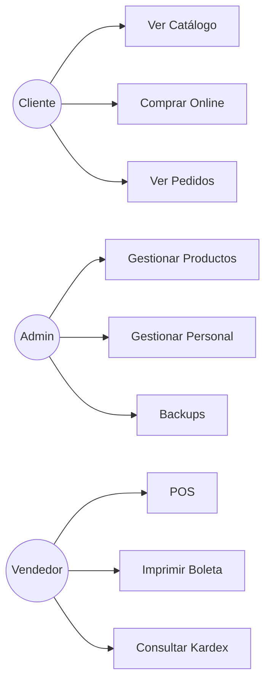
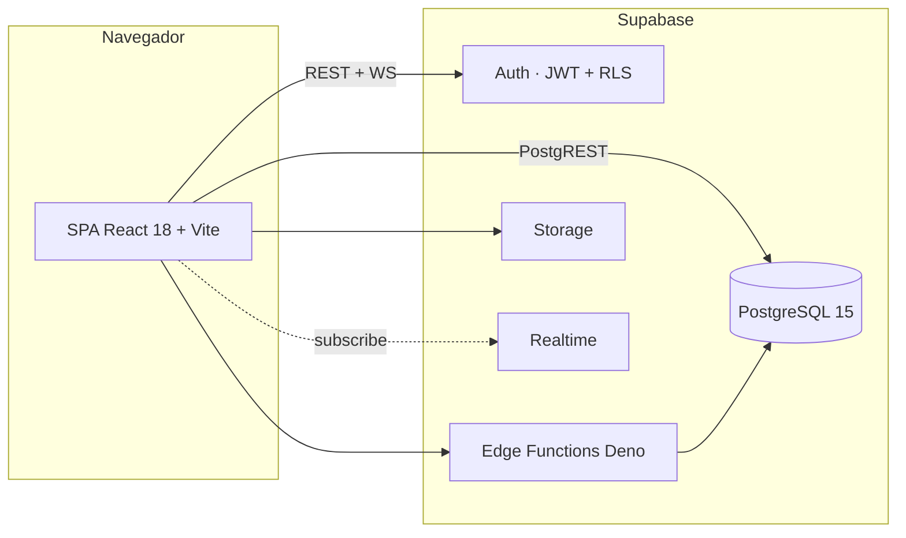
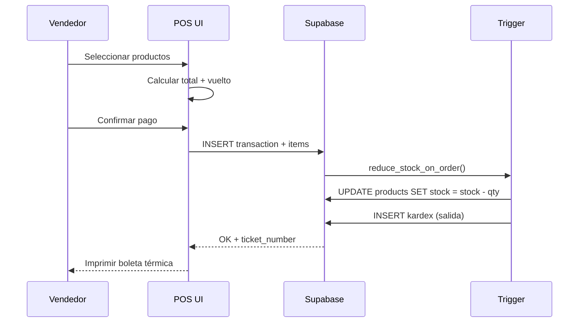
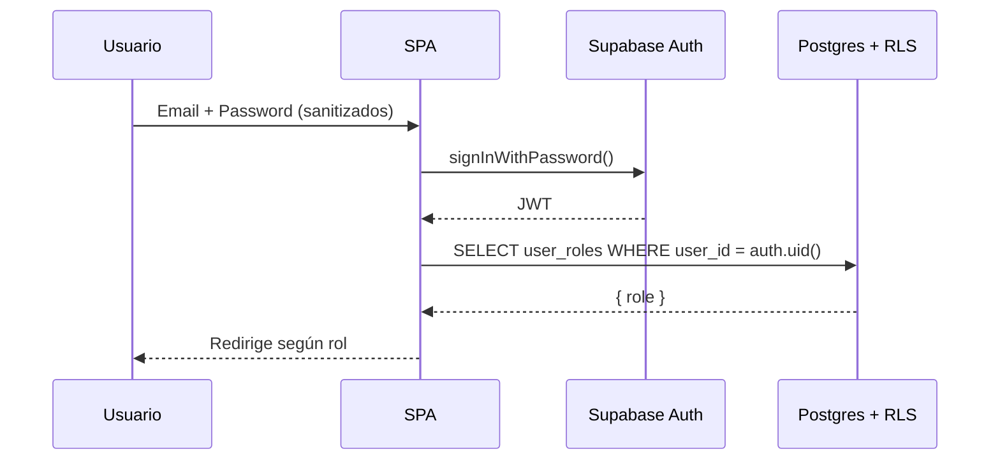

# Informe Técnico de Implementación de Modelos de Calidad y Procesos de Software

**Proyecto:** Sistema de Gestión para Ferretería DIMAR
**Curso:** Calidad de Software
**Modelo aplicado:** CMMI-DEV v1.3 — Nivel de Madurez 2 (Gestionado)
**Metodologías de soporte:** TSP (Team Software Process) y PSP (Personal Software Process)
**Repositorio (evidencia real):** este mismo proyecto, desplegado en `https://ferreteria-dimar.lovable.app`

> **Nota académica:** Este documento NO es un README de producto ni una guía de instalación. Es un documento orientado a evidenciar el cumplimiento de las áreas de proceso de **CMMI-DEV v1.3 Nivel 2** a partir de artefactos reales generados por el proyecto DIMAR. Donde una práctica del modelo no cuenta con evidencia real, se indica explícitamente como **PENDIENTE DE COMPLETAR** y no se da por cumplida.

---

## Índice

1. Introducción del Proyecto
2. Marco Organizacional (TSP)
3. Gestión de Requisitos (REQM)
4. Planificación del Proyecto (PP)
5. Gestión de la Configuración (CM)
6. Aseguramiento de la Calidad de Procesos y Productos (PPQA)
7. Disciplina Personal (PSP)
8. Medición y Análisis (MA)
9. Análisis de Brechas CMMI (Gap Analysis)
10. Conclusiones
11. Anexos

---

## 1. Introducción del Proyecto

### 1.1 Propósito del proyecto
DIMAR Ferretería (Ilo, Moquegua – Perú) requería digitalizar su operación comercial: catálogo en línea, ventas presenciales, control de inventario, contabilidad básica, gestión de personal y atención al cliente por WhatsApp. El presente proyecto entrega una plataforma web responsive con backend serverless, **utilizada como caso de estudio** para evidenciar la aplicación de las prácticas específicas y genéricas de CMMI-DEV v1.3 Nivel 2.

### 1.2 Objetivos
**Objetivo general.** Implementar un sistema integral de e-commerce y gestión interna para DIMAR Ferretería siguiendo prácticas alineadas a CMMI-DEV v1.3 Nivel 2.

**Objetivos específicos.**
- Centralizar catálogo, stock, ventas, compras y CRM en una sola plataforma.
- Aplicar las siete áreas de proceso de Nivel 2: REQM, PP, PMC, SAM, CM, PPQA y MA.
- Generar evidencia auditable de cada área de proceso (commits, artefactos de CI, migraciones SQL, políticas RLS, reportes JUnit/JSON).
- Documentar las brechas detectadas y un plan de mejora.

### 1.3 Alcance
- **Incluye:** tienda pública, panel de administración, punto de venta (POS), gestión de productos/categorías/marcas, kardex automatizado, transacciones unificadas (venta/servicio/mixto), CRM con clasificación VIP, gestión de personal y asistencia, notificaciones realtime al staff, exportes Excel/JSON, integración con `apis.net.pe` para consulta DNI, autenticación con Supabase Auth y Row-Level Security en toda tabla pública.
- **No incluye:** facturación electrónica firmada ante SUNAT (queda como ticket/boleta local), integración nativa con pasarelas de pago automáticas (Yape/Plin/Lemon se procesan con voucher manual), aplicación móvil nativa, integración con ERP externo.

### 1.4 Descripción general
Aplicación web SPA construida con React 18 + Vite + TypeScript + Tailwind, con backend gestionado en Supabase (PostgreSQL 15 + Auth + Storage + Edge Functions + Realtime). El despliegue de producción se realiza sobre la infraestructura de Lovable; el código fuente se versiona en GitHub y se ejecuta un pipeline de CI en GitHub Actions (Quality Gate) en cada `push` y `pull_request`.

---

## 2. Marco Organizacional (TSP)

### 2.1 Roles y responsabilidades

| Rol TSP | Responsabilidad principal en el proyecto |
|---|---|
| Team Leader | Coordinación general, sincronización con el cliente (DIMAR), seguimiento de avance. |
| Development Manager | Diseño técnico, arquitectura de base de datos, RLS, edge functions. |
| Planning Manager | Cronograma, WBS, registro de tiempos (PSP Time Log). |
| Quality / Process Manager | Definición del Quality Gate (CI), políticas RLS, registro de defectos (PSP Defect Log). |
| Support Manager | Configuración de Supabase, despliegue, gestión de buckets y secretos. |

> **Nota:** El proyecto fue desarrollado en un equipo académico reducido, por lo que un mismo integrante puede asumir más de un rol TSP. La matriz **RACI nominal por integrante** debe completarse con los nombres reales del equipo — **PENDIENTE DE COMPLETAR**.

### 2.2 Estrategia de desarrollo utilizada
Se siguió un proceso **iterativo e incremental** con entregas funcionales por módulo (auth → catálogo → POS → kardex → CRM → personal → reportes). No se aplicó un framework Scrum formal con sprints fijos: las iteraciones se gestionaron por *milestones* funcionales contra el repositorio.

### 2.3 Herramientas utilizadas realmente en el proyecto

| Herramienta | Uso real verificable |
|---|---|
| **GitHub** | Repositorio, historial de commits, Pull Requests, GitHub Actions (CI). |
| **Supabase (Lovable Cloud)** | PostgreSQL, Auth, Storage, Edge Functions, Realtime. Migraciones versionadas en `supabase/migrations/`. |
| **Lovable / Vercel-compatible** | Build Vite + despliegue continuo del SPA (`vercel.json` presente en el repo, despliegue real en `ferreteria-dimar.lovable.app`). |
| **Vitest + GitHub Actions** | Pruebas unitarias y Quality Gate automatizado (`.github/workflows/ci.yml`). |
| **ESLint + TypeScript estricto** | Verificación estática. |
| **Figma** | **PENDIENTE DE COMPLETAR** — el proyecto no tiene un archivo Figma vinculado. Si se incorporan mockups, deben referenciarse aquí. |

### 2.4 Evidencias de herramientas

- **GitHub:** historial completo de commits y workflow `.github/workflows/ci.yml`. Cada corrida queda registrada en la pestaña *Actions* con el SHA del commit.
- **Supabase:** carpeta `supabase/migrations/` con migraciones SQL secuenciales; carpeta `supabase/functions/` con las Edge Functions `dni-lookup` y `create-staff-account`; buckets de Storage `product-images`, `brand-logos`, `receipt-assets`, `category-catalogs`.
- **Vercel / Lovable:** archivo `vercel.json` con `framework: vite` y `rewrites` SPA; URL pública en producción.
- **Figma:** **PENDIENTE DE COMPLETAR**.

---

## 3. Gestión de Requisitos (REQM)

### 3.1 Requisitos funcionales

| ID | Requisito | Módulo |
|---|---|---|
| RF-01 | Registro y login de usuarios con email/contraseña | `src/features/auth` |
| RF-02 | Catálogo público con filtros, búsqueda y navegación por categoría | `src/features/shop` |
| RF-03 | Carrito de compras y checkout | `src/features/cart`, `src/features/checkout` |
| RF-04 | Punto de venta (POS) con cálculo de cambio y ticket | `src/features/admin/pages/SalesPage.tsx` |
| RF-05 | Gestión de productos, categorías y marcas con auto-SKU | `ProductsPage.tsx`, `CategoriesPage.tsx`, `BrandsPage.tsx` |
| RF-06 | Kardex automatizado por trigger de base de datos | `KardexPage.tsx` + triggers SQL |
| RF-07 | Gestión de proveedores y órdenes de compra | `SuppliersPage.tsx`, `PurchasesPage.tsx` |
| RF-08 | CRM con clasificación VIP por consumo acumulado | `CustomersPage.tsx` |
| RF-09 | Gestión de personal, cuentas y asistencia con turnos cruza-medianoche | `StaffPage.tsx`, `AttendancePage.tsx` |
| RF-10 | Notificaciones realtime al staff (Supabase Realtime) | `NotificationBell.tsx`, `src/lib/notifications.ts` |
| RF-11 | Reportes contables y exportación Excel estilizada | `AccountingPage.tsx`, `DataImportExport.tsx` |
| RF-12 | Consulta DNI vía `apis.net.pe` con fallback manual | `supabase/functions/dni-lookup` |

### 3.2 Requisitos no funcionales

| ID | Requisito | Evidencia |
|---|---|---|
| RNF-01 Seguridad | RLS habilitado en todas las tablas públicas; roles separados en `user_roles` con función `has_role()` *security definer*. | Migraciones `supabase/migrations/` |
| RNF-02 Sanitización de entradas | Toda caja de texto de autenticación pasa por `sanitizeText`, `sanitizeEmail`, `sanitizePhone` y esquemas Zod. | `src/lib/sanitize.ts` + tests |
| RNF-03 Mantenibilidad | TypeScript estricto + ESLint en CI. | `tsconfig.app.json`, `eslint.config.js`, `.github/workflows/ci.yml` |
| RNF-04 Trazabilidad | Cada cambio queda anclado al SHA en GitHub; cada corrida de CI publica artefactos por 30 días. | Actions + `reports/` |
| RNF-05 Disponibilidad | Desplegado sobre infraestructura serverless gestionada. | URL pública |
| RNF-06 Internacionalización monetaria | Moneda fija en Soles peruanos (`S/`). | `src/lib/constants.ts` |

### 3.3 Matriz de trazabilidad — requisito → módulo → evidencia

| Requisito | Módulo de código | Evidencia verificable |
|---|---|---|
| RF-01 | `src/features/auth/pages/LoginPage.tsx`, `RegisterPage.tsx` | Tests de schemas Zod en `src/lib/sanitize.test.ts` (8–11) |
| RF-04 | `SalesPage.tsx`, `PrintReceipt.tsx` | Función SQL de generación de ticket `INF-YYYYMMDD-XXXX` |
| RF-06 | Triggers `reduce_stock_on_order`, tabla `kardex` | Migraciones SQL |
| RF-10 | `NotificationBell.tsx` | Suscripción a `postgres_changes` en cliente Supabase |
| RF-12 | `supabase/functions/dni-lookup` | Edge Function deployada |
| RNF-01 | Todas las tablas | Resultado del **Supabase Linter** (anexo 11.2) |
| RNF-02 | Auth pages | `src/lib/sanitize.test.ts` — 11/11 tests pass |

### 3.4 Gestión de cambios de requisitos
Los cambios se gestionan exclusivamente vía **Pull Request en GitHub**. Cada PR debe describir el requisito afectado, los archivos modificados y dejar el Quality Gate en verde antes del merge. El historial de Git constituye el log oficial de cambios. **Plantilla formal de PR (`.github/pull_request_template.md`): PENDIENTE DE COMPLETAR**.

---

## 4. Planificación del Proyecto (PP)

### 4.1 Cronograma real
Las iteraciones se ejecutaron por módulos funcionales, registrados como commits/PR en GitHub. **El cronograma con fechas reales (inicio/fin por módulo) debe extraerse del historial `git log --pretty=format:"%ad %s" --date=short` y adjuntarse como anexo — PENDIENTE DE COMPLETAR con fechas verificables**.

### 4.2 Work Breakdown Structure (WBS)

```
1. Sistema DIMAR
├── 1.1 Frontend SPA (React + Vite + TS)
│   ├── 1.1.1 Tienda pública
│   ├── 1.1.2 Carrito y checkout
│   ├── 1.1.3 Panel de administración
│   └── 1.1.4 Punto de Venta (POS)
├── 1.2 Backend (Supabase)
│   ├── 1.2.1 Esquema y migraciones SQL
│   ├── 1.2.2 RLS y roles (has_role + user_roles)
│   ├── 1.2.3 Edge Functions (dni-lookup, create-staff-account)
│   ├── 1.2.4 Storage (4 buckets)
│   └── 1.2.5 Realtime (notificaciones)
├── 1.3 Aseguramiento de Calidad
│   ├── 1.3.1 Quality Gate (CI Vitest + ESLint)
│   ├── 1.3.2 Sanitización + Zod
│   └── 1.3.3 Supabase Linter
└── 1.4 Despliegue continuo
```

### 4.3 Estimaciones
Las estimaciones se realizaron a nivel de módulo, no por historia de usuario. **Estimación formal por método PROBE (PSP) — PENDIENTE DE COMPLETAR**: requiere registrar tamaño en LOC, tiempo estimado y tiempo real por componente.

### 4.4 Gestión de riesgos

| Riesgo | Probabilidad | Impacto | Mitigación implementada |
|---|---|---|---|
| Pérdida de datos | Baja | Alto | Exporte JSON desde el panel + backups automáticos de Supabase. |
| Escalada de privilegios | Baja | Alto | Roles fuera de `profiles` (tabla `user_roles` + `has_role()` *security definer*). |
| XSS en formularios | Media | Alto | `src/lib/sanitize.ts` aplicado a login/registro, validado por 11 tests. |
| Política RLS faltante | Media | Alto | Supabase Linter ejecutado tras cada migración. |
| Indisponibilidad del proveedor | Baja | Alto | Reintento del lado del cliente + caché de TanStack Query. |

### 4.5 Seguimiento del avance (PMC)
El avance se evidencia mediante:
- **GitHub Insights / Pulse:** commits, PRs cerrados, contribuyentes.
- **GitHub Actions:** estado verde/rojo del Quality Gate en cada commit.
- **Tablero de estado del proyecto en GitHub Projects: PENDIENTE DE COMPLETAR** (no se ha configurado un board formal con columnas Todo/Doing/Done).

---

## 5. Gestión de la Configuración (CM)

### 5.1 Identificación de elementos de configuración (CI)

| Elemento | Ubicación | Tipo |
|---|---|---|
| Código fuente del SPA | `src/` | Versionado en Git |
| Migraciones de base de datos | `supabase/migrations/` | Versionado en Git, inmutable |
| Edge Functions | `supabase/functions/` | Versionado en Git |
| Workflows de CI | `.github/workflows/ci.yml` | Versionado en Git |
| Configuración de despliegue | `vercel.json`, `vite.config.ts` | Versionado en Git |
| Tests automatizados | `src/**/*.test.ts` | Versionado en Git |
| Reportes generados por CI | `reports/junit.xml`, `reports/test-results.json` | Artefacto inmutable retenido 30 días |
| Variables de entorno | `.env` (local) + secretos de despliegue | Fuera de Git (`.gitignore`) |

### 5.2 Control de versiones mediante GitHub
- Repositorio único en GitHub.
- Rama principal: `main`.
- Cada cambio entra por *commit* directo o *Pull Request*.
- Convención sugerida: **Conventional Commits** (`feat:`, `fix:`, `chore:`, `docs:`).

### 5.3 Gestión de cambios
1. Identificación del cambio (nuevo requisito, defecto, mejora).
2. Implementación en una rama o commit identificado.
3. Ejecución automática del Quality Gate (GitHub Actions).
4. Revisión por al menos otro integrante (PR) — **regla de revisión obligatoria: PENDIENTE DE FORMALIZAR** en `CODEOWNERS`.
5. Merge a `main` y despliegue automático.

### 5.4 Líneas base
Cada commit en `main` que pasa el Quality Gate constituye una **línea base implícita** (SHA inmutable + artefacto `vitest-reports` retenido 30 días). **Líneas base formales con tags semver (`v1.0.0`, `v1.1.0`…): PENDIENTE DE COMPLETAR**.

### 5.5 Evidencias de commits, ramas y versiones
- Historial completo en GitHub.
- Migraciones SQL versionadas con timestamp en su nombre.
- Artefactos `vitest-reports.zip` descargables desde la pestaña *Actions* (ver anexo 11.5).

---

## 6. Aseguramiento de la Calidad de Procesos y Productos (PPQA)

### 6.1 Criterios de calidad

| Criterio | Mecanismo |
|---|---|
| Código tipado y consistente | TypeScript estricto + ESLint en CI. |
| Entradas sanitizadas | `sanitizeText / sanitizeEmail / sanitizePhone` + esquemas Zod. |
| Seguridad de datos | RLS por tabla, roles en tabla aparte, función `has_role()` *security definer*. |
| Reproducibilidad de build | `npm ci` desde `package-lock.json`. |
| Trazabilidad de pruebas | Reportes JUnit + JSON publicados por CI. |

### 6.2 Checklist QA (aplicado en cada PR)

- [ ] El Quality Gate de GitHub Actions está en verde.
- [ ] No hay errores de ESLint nuevos.
- [ ] No hay errores de TypeScript (`tsc --noEmit`).
- [ ] Si se tocó alguna tabla pública, la migración incluye `GRANT` y `RLS`.
- [ ] Si se agregó un input de texto, está sanitizado y validado por Zod.
- [ ] Si se agregó lógica crítica, se acompañó de un test.
- [ ] El Supabase Linter no reporta nuevos hallazgos críticos.

### 6.3 Hallazgos encontrados (reales)

| Hallazgo | Origen | Resolución |
|---|---|---|
| Ausencia de sanitización en inputs de login/registro | Revisión manual | Implementado `src/lib/sanitize.ts` + 11 tests. |
| Ruta `/` devolvía 404 al recargar (F5) en despliegue estático | Validación manual | `vercel.json` con `rewrites` SPA → `/index.html`. |
| Tests de regresión inexistentes en CI | Auto-auditoría PPQA | Workflow `.github/workflows/ci.yml` + suite Vitest. |

### 6.4 Defectos detectados y estado

| ID defecto | Descripción | Severidad | Estado |
|---|---|---|---|
| D-001 | Login no sanitizaba caracteres HTML | Alta | Corregido (sanitize.ts) |
| D-002 | 404 en refresh de SPA tras deploy | Alta | Corregido (`vercel.json`) |
| D-003 | Falta de evidencia automatizada de tests | Media | Corregido (CI Quality Gate) |

**Defect Log completo del PSP: PENDIENTE DE COMPLETAR** (debe registrarse por integrante con fecha, fase de introducción, fase de detección y tiempo de corrección).

### 6.5 Evidencias de revisión
- Artefacto `vitest-reports.zip` por corrida.
- Salida `reports/junit.xml` con 12 casos pasados en la última corrida local registrada.
- Bitácora de revisiones por pares: **PENDIENTE DE COMPLETAR** (acta de revisión por PR).

---

## 7. Disciplina Personal (PSP)

### 7.1 Time Log
Registro por integrante de tiempo dedicado por fase (planificación, diseño, codificación, revisión, pruebas, corrección). **PENDIENTE DE COMPLETAR**: el equipo debe entregar la plantilla TIME_LOG.xlsx por integrante.

### 7.2 Defect Log
Registro por defecto: ID, descripción, fase de introducción, fase de detección, tipo (sintaxis, lógica, interfaz, datos…), tiempo de corrección. El proyecto cuenta con un Defect Log inicial (sección 6.4) pero **debe extenderse por integrante — PENDIENTE DE COMPLETAR**.

### 7.3 Productividad del equipo
Cualquier indicador de productividad (LOC/hora, defectos/KLOC, % retrabajo) debe calcularse a partir del Time Log y Defect Log reales. **PENDIENTE DE COMPLETAR**: no se reportan cifras inventadas.

---

## 8. Medición y Análisis (MA)

### 8.1 Métricas reales obtenidas del proyecto

Extraídas del archivo `reports/test-results.json` generado por la última corrida de Vitest registrada:

| Métrica | Valor real | Fuente |
|---|---|---|
| Suites de prueba totales | 8 | `numTotalTestSuites` |
| Suites pasadas | 8 | `numPassedTestSuites` |
| Tests totales | 12 | `numTotalTests` |
| Tests pasados | 12 | `numPassedTests` |
| Tests fallidos | 0 | `numFailedTests` |
| Tasa de éxito | 100 % | `numPassedTests / numTotalTests` |
| Duración total de la suite `sanitize` | ≈ 24.6 ms | `time` en `junit.xml` |

> Cualquier métrica adicional (cobertura %, MTTR, velocity, defectos por KLOC, LCP, disponibilidad mensual) **no se reporta porque no existe medición real disponible — PENDIENTE DE COMPLETAR**.

### 8.2 Indicadores de calidad
- Tasa de éxito de tests por corrida (extraída del JSON de Vitest).
- Cantidad de hallazgos críticos del Supabase Linter (objetivo: 0).
- Estado del Quality Gate (verde/rojo) en cada commit.

### 8.3 Indicadores de productividad
**PENDIENTE DE COMPLETAR**: requiere Time Log del PSP.

### 8.4 Dashboard de métricas
**PENDIENTE DE COMPLETAR**: la conexión a Looker Studio u otra herramienta de visualización aún no está configurada. La fuente de datos prevista es el `reports/test-results.json` publicado por CI.

### 8.5 Interpretación de resultados
Con la evidencia actual se puede afirmar objetivamente que:
- El 100 % de los casos de prueba implementados pasan en la última corrida.
- Las prácticas de sanitización (RNF-02) están cubiertas por pruebas automatizadas.
- El proyecto cuenta con evidencia auditable de PPQA y CM.

No se puede afirmar — sin caer en datos inventados — cobertura, productividad ni disponibilidad histórica.

---

## 9. Análisis de Brechas CMMI (Gap Analysis)

### 9.1 Matriz de cumplimiento — Áreas de proceso de Nivel 2

| Área de proceso | Estado | Evidencia | Brecha |
|---|---|---|---|
| **REQM** — Requirements Management | Parcial | Sección 3 (requisitos + matriz) | Falta plantilla formal de PR y documento de aceptación firmado por el cliente. |
| **PP** — Project Planning | Parcial | Sección 4 (WBS + riesgos) | Falta cronograma con fechas reales y estimaciones PROBE. |
| **PMC** — Project Monitoring and Control | Parcial | GitHub Insights + Actions | Falta tablero formal (GitHub Projects) y actas de seguimiento. |
| **SAM** — Supplier Agreement Management | No aplica directo | Proveedores son SaaS gratuitos (GitHub, Supabase/Lovable, apis.net.pe). | Si se formaliza contrato con proveedor de pago, documentar SLA. |
| **CM** — Configuration Management | Cumplido en lo esencial | Sección 5 + GitHub + migraciones | Falta esquema de tags semver y CODEOWNERS. |
| **PPQA** — Process and Product QA | Cumplido | Sección 6 + CI Quality Gate | Bitácora formal de revisiones por pares pendiente. |
| **MA** — Measurement and Analysis | Parcial | Sección 8 + reports JSON/JUnit | Faltan métricas de productividad y dashboard. |

### 9.2 Brechas encontradas
1. Falta de **cronograma real con fechas** y **estimación PROBE**.
2. Falta de **plantillas formales** (PR, acta de revisión, acta de aceptación).
3. Falta de **Time Log y Defect Log por integrante** (PSP).
4. Falta de **dashboard de métricas** (Looker Studio o similar).
5. Falta de **tags semver** como líneas base formales.

### 9.3 Plan de mejora

| Acción de mejora | Área CMMI | Responsable | Estado |
|---|---|---|---|
| Crear `.github/pull_request_template.md` | REQM, CM | Quality Manager | Pendiente |
| Definir `.github/CODEOWNERS` y proteger `main` | CM, PPQA | Support Manager | Pendiente |
| Etiquetar versiones con `git tag vX.Y.Z` tras cada hito | CM | Team Leader | Pendiente |
| Llenar Time Log + Defect Log por integrante | PSP, MA | Cada integrante | Pendiente |
| Conectar `test-results.json` a Looker Studio | MA | Quality Manager | Pendiente |
| Anexar cronograma extraído de `git log` | PP | Planning Manager | Pendiente |

---

## 10. Conclusiones

- El proyecto DIMAR cuenta con evidencia **real y auditable** de las áreas de proceso CM, PPQA y MA de CMMI-DEV v1.3 Nivel 2 (control de versiones en GitHub, Quality Gate automatizado en GitHub Actions, reportes JUnit/JSON, migraciones versionadas, RLS por tabla, sanitización de entradas con pruebas).
- Las áreas REQM, PP, PMC y MA están **parcialmente cubiertas**: existen los artefactos técnicos, pero faltan los formatos académicos del proceso (plantillas, actas, Time Log, dashboard).
- SAM no aplica de forma material al alcance del proyecto.
- El presente documento sirve como **línea base académica** sobre la cual el equipo puede cerrar las brechas identificadas en la sección 9.3 sin necesidad de modificar el producto.

---

## 11. Anexos

### 11.1 Evidencias de GitHub
- Repositorio y rama `main`.
- Pestaña **Actions** → workflow **CI - Quality Gate** (definido en `.github/workflows/ci.yml`).
- Cada corrida deja un artefacto `vitest-reports` descargable durante 30 días.

### 11.2 Evidencias de Supabase
- Migraciones SQL en `supabase/migrations/`.
- Edge Functions en `supabase/functions/dni-lookup/` y `supabase/functions/create-staff-account/`.
- Buckets de Storage: `product-images`, `brand-logos`, `receipt-assets`, `category-catalogs`.
- Resultado del **Supabase Linter** sobre RLS — adjuntar captura cuando se ejecute en el dashboard.

### 11.3 Evidencias de Vercel / Hosting
- Archivo `vercel.json` con `framework: vite` y reglas `rewrites` para soportar SPA en F5.
- URL pública en producción: `https://ferreteria-dimar.lovable.app`.

### 11.4 Evidencias de Figma
**PENDIENTE DE COMPLETAR** — adjuntar enlace al archivo Figma si se incorpora al proyecto.

### 11.5 Evidencias de QA — Reportes Vitest en CI

Generados automáticamente por `.github/workflows/ci.yml`:

```
reports/junit.xml            ← compatible con Jira, Allure, dorny/test-reporter
reports/test-results.json    ← apto para Looker Studio / análisis MA
```

Última corrida registrada:

| Indicador | Valor |
|---|---|
| Suites totales | 8 |
| Tests totales | 12 |
| Tests pasados | 12 |
| Tests fallidos | 0 |
| Tasa de éxito | 100 % |

**Suite principal — `src/lib/sanitize.test.ts`:**

| # | Test | Riesgo cubierto |
|---|---|---|
| 1 | Elimina `<script>` | XSS reflejado |
| 2 | Remueve `onclick=` | XSS por handler inline |
| 3 | Bloquea `javascript:` | XSS por URL maliciosa |
| 4 | Colapsa espacios y `trim` | Datos sucios |
| 5 | Respeta `maxLength` | Overflow de columnas |
| 6 | `sanitizeEmail` normaliza minúsculas | Duplicados por mayúsculas |
| 7 | `sanitizePhone` filtra caracteres | Inyección en SMS/WhatsApp |
| 8 | `loginSchema` acepta válidos | Regression guard |
| 9 | `loginSchema` rechaza email inválido | Validación REQM |
| 10 | `registerSchema` rechaza passwords distintas | UX + integridad |
| 11 | `registerSchema` rechaza nombre con `<script>` | XSS desde signup |

### 11.6 Evidencias de Defect Log
- Defect Log inicial en sección 6.4.
- Defect Log extendido por integrante: **PENDIENTE DE COMPLETAR**.

### 11.7 Evidencias de Dashboard Looker Studio
**PENDIENTE DE COMPLETAR** — fuente de datos disponible: `reports/test-results.json` publicado por CI.

### 11.8 Evidencias de Cronograma y WBS
- WBS en sección 4.2.
- Cronograma con fechas reales: **PENDIENTE DE COMPLETAR** — generar desde `git log --pretty=format:"%ad %s" --date=short` y anexar.

### 11.9 Anexo técnico — Diagramas UML (apoyo arquitectónico)

Los diagramas UML originales se conservan como apoyo técnico a la trazabilidad de requisitos (REQM) y al diseño de la solución (no constituyen por sí mismos evidencia CMMI, pero respaldan los artefactos de las áreas REQM y PP).

#### 11.9.1 Casos de uso


#### 11.9.2 Diagrama de contenedores (C4 nivel 2)


#### 11.9.3 Secuencia — Venta POS


#### 11.9.4 Secuencia — Login con RLS


---

© 2026 DIMAR Ferretería — Ilo, Moquegua, Perú. Documento académico para el curso de Calidad de Software (CMMI-DEV v1.3 Nivel 2).
